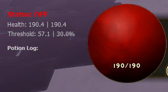
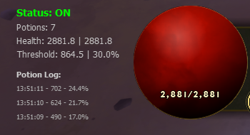

# Auto Potion Tool 🧌

[]()
[]()

A game tool for Dwarven Realms that automatically uses potions when HP drops below a configurable threshold. Attaches to the game process via pymem and reads player health data from memory using iterative pointer dereferencing with pointer chain resolution. Memory reading runs in a separate background thread with thread-safe operation. Features a PyQt5 overlay window with transparency and always-on-top behavior, and is also thread-safe for responsiveness. 

**⚠️ Warning**: This tool is intended for **offline use only**. While it may work online, use it at your own risk and discretion.


**A few important notes:**

* While it's not a guarantee of survival, it will save you most of the time. It works with any class or build, just make sure you always have enough potions!
* Because of how the game handles health and damage over time (DoT), if you take a lot of DoT or very fast hits, your HP can drop below the threshold very quickly, multiple times or stay below the threshold even with potion drinks. The potion will trigger as soon as your real HP drops below the threshold, but if the accumulated or incoming damage is higher than what a potion can heal, you might still die.


## ✨ Features

<p align="center">
  
  
</p>

* **Auto Potion**: Automatically triggers a potion when HP falls below a set percentage.
* **Potion log**: The overlay displays a log of recent potion uses, showing HP values and timestamps for each use.
* **Overlay UI**: Movable, lockable PyQt5 overlay showing status, HP, and logs.
* **Customizable Hotkeys**: Easily change hotkeys for toggling ON/OFF, locking, and closing the overlay.
* **Safe & Configurable**: All settings in a user-friendly config file.

## 🛠️ Setup Instructions

You can use the tool in three ways:

### 1. Download the Executable

* Download the latest release from the Releases page.
* Run the `.exe` file directly.

### 2. Local Setup

* Clone the repository:  
```bash
git clone https://github.com/leobrqz/AutoPot-DR
cd AutoPot-DR
```
* Install dependencies:  
```bash
pip install -r requirements.txt
```
Now either run it with python or build the executable.

### Run with Python

* Run the application:  
```bash
python src/main.py
```

### Build the Executable Yourself

* Build the executable with PyInstaller:  
```bash
./build_release.sh
```
* The executable will be in the `release` folder.

## ⚙️ Configuration

The application creates a `config_user.ini` file on first run with default settings. You can modify this file to customize the tool's behavior.

### General 

- **`health_threshold`** (default: `30.0`)
  - The health percentage threshold at which the tool will automatically use a potion.


### Overlay 

- **`pos_x`** (default: `200`)
- **`pos_y`** (default: `880`)
- **`locked`** (default: `False`)
  - Whether the overlay is locked (cannot be moved) on startup.

### Keybinds 

Customize the global hotkeys used to control the tool:

- **`hotkey_lock`** (default: `home`)
  - Toggle overlay lock/unlock (prevents moving the overlay).
- **`hotkey_toggle`** (default: `insert`)
  - Toggle auto potion feature on/off.
- **`hotkey_close`** (default: `end`)
  - Close the application.


